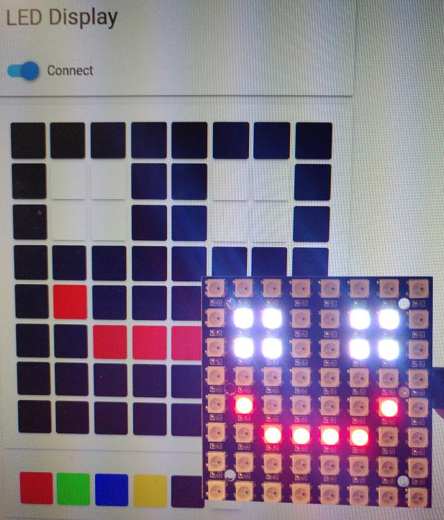
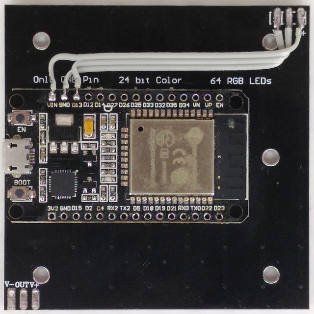
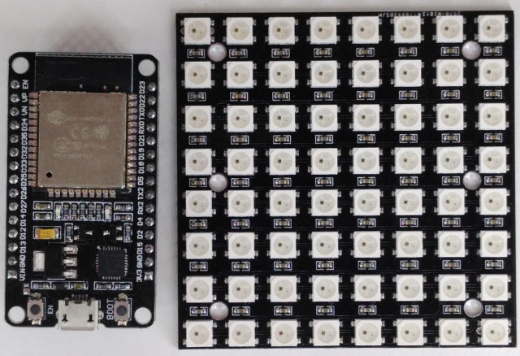

# Dotlite

Lightweight implementation of a
[DOTTI](https://www.wittidesign.com/products/dotti-one) like device
compatible with the [Webbluetooth LED Display
Demo](https://github.com/WebBluetoothCG/demos/tree/gh-pages/bluetooth-led-display).

This device is in not way delated to the original dotti. It instead
implements only the interface expected by the Webbluetooth LED Display
Demo. It's therefore probably incopatible with any other software meant
to be used with the DOTTI.

The hardware is rather simple and cheap as it consists only of an
ESP32 develoment board and a 8x8 WS2812b RGB LED matrix display. Both
are connected using three wires:

  * ESP32 VIN goes to V+ on the display
  * ESP32 GND goes to V- on the display
  * ESP32 D13 goes to IN on the display

The Arduino sketch requires the Adafruit NeoPixel ĺibrary which can be
installed from the Arduino library manager.

